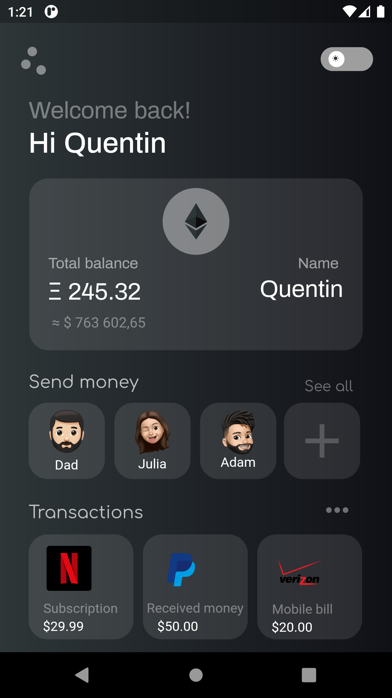
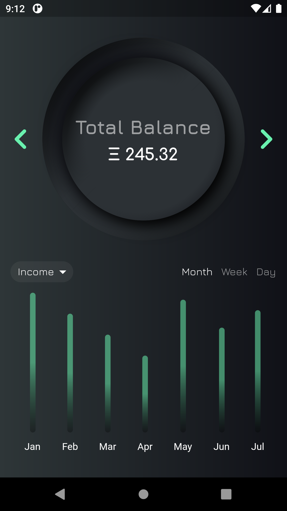

# uidesigns

A quick design of an app with Flutter.

## Getting Started

I've created a small 3 page Ui design of a banking app.

For help getting started with Flutter development, view the
[online documentation](https://docs.flutter.dev/), which offers tutorials,
samples, guidance on mobile development, and a full API reference.
